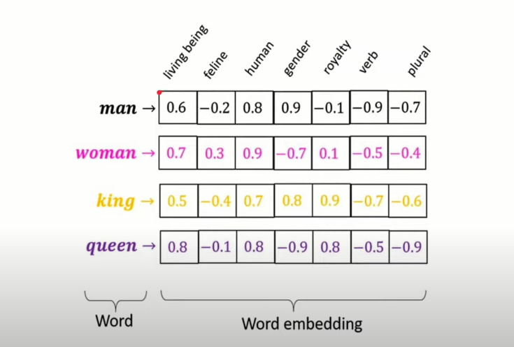
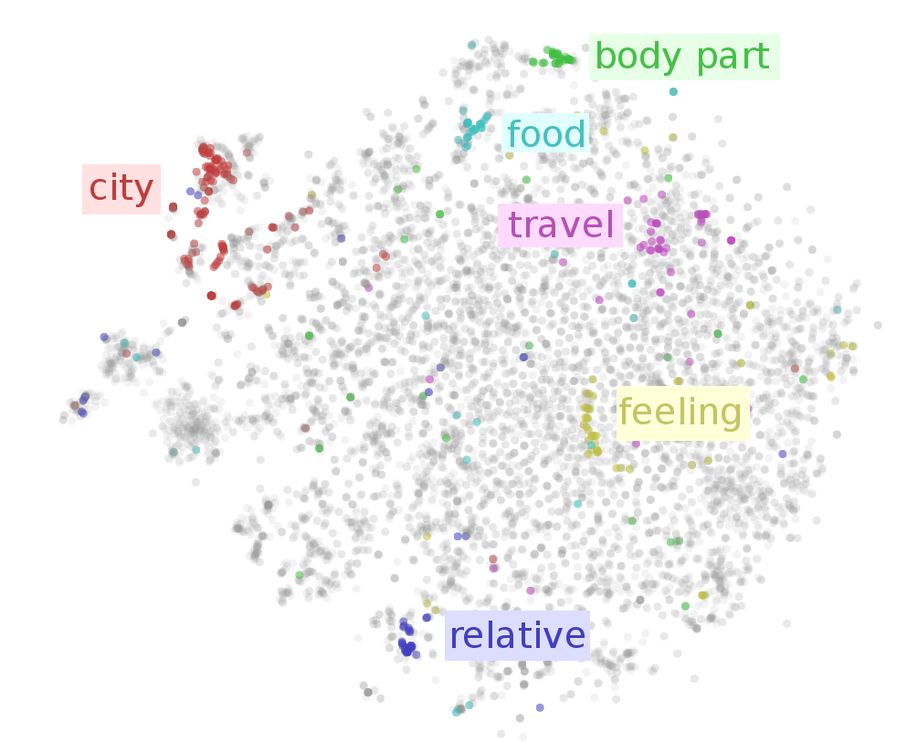
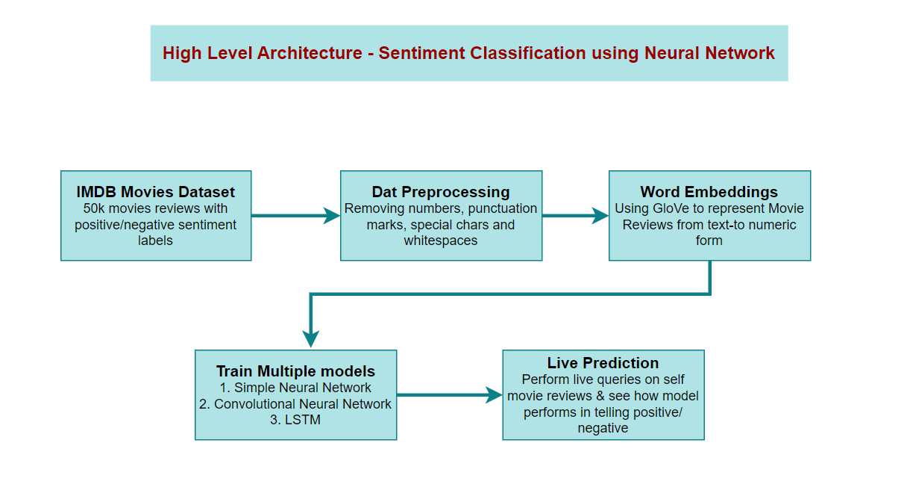
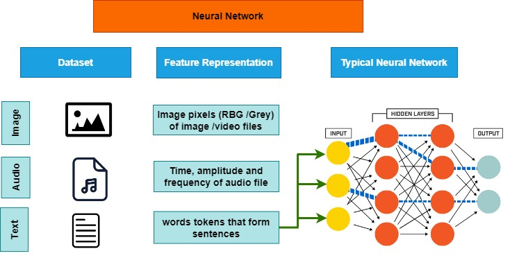
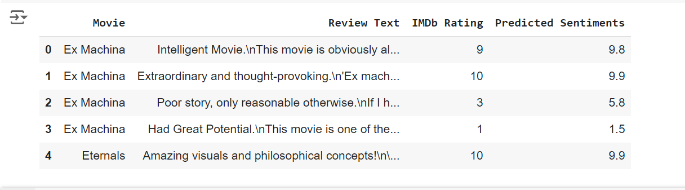
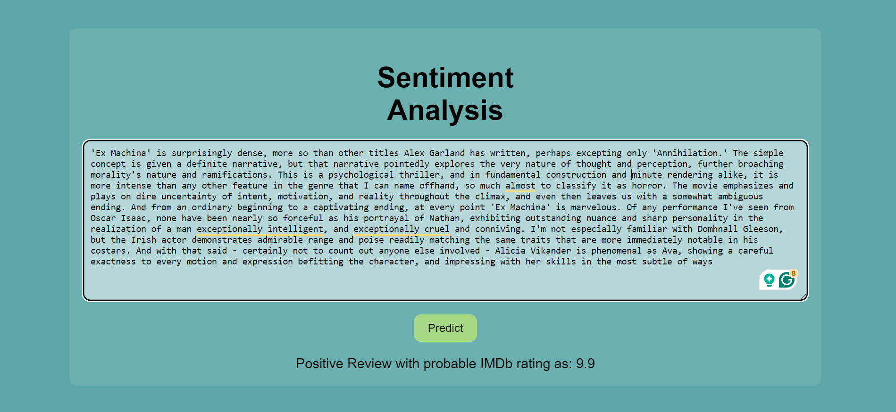

# Sentiment Analysis with Neural Networks
 
<b>Project Overview</b>
 
This project is a comprehensive sentiment analysis application using neural networks. It processes IMDb movie reviews to determine whether the sentiment expressed in each review is positive or negative. The project employs various deep learning models, including a Simple Neural Network, a Convolutional Neural Network (CNN), and a Long Short-Term Memory (LSTM) network, to analyze the sentiments. 
 

# Dataset
 

The dataset used in this project is the IMDb Movie Reviews dataset, containing 50,000 reviews labeled as positive or negative. The dataset can be found on [Kaggle.](https://www.kaggle.com/datasets/lakshmi25npathi/imdb-dataset-of-50k-movie-reviews)
 

# Project Structure
 

 ├── IMDB_Dataset.csv  
 ├── glove.6B.100d.txt  
 ├── IMDb_Unseen_Reviews.csv  
 ├── IMDB_Review_sentiment_Analysis.ipynb 
 ├── lstm_model.h5 
 └── IMDb_Unseen_Reviews.csv (with predicted output)  
 
 <b>IMDB_Dataset.csv:</b> The main dataset containing 50,000 IMDb movie reviews. 
  <b>glove.6B.100d.txt: </b>Pre-trained GloVe word embeddings. 
  <b>IMDb_Unseen_Reviews.csv: </b>A sample dataset for making predictions with new, unseen reviews. 
  <b>IMDB_Review_sentiment_Analysis.ipynb: </b>Jupyter notebook containing the project code.   <b>lstm_model.h5:</b> Saved LSTM model with an accuracy of 85.6%. 
  <b>IMDb_Unseen_Predictions.csv:</b> Output predictions for new IMDb reviews. 

# Data Preprocessing
 
The data preprocessing steps include:
 
Removing special characters, numbers, and HTML tags from the reviews. 
Converting all text to lowercase. 
Removing stopwords using NLTK's stopwords list. 
Tokenizing and padding the sequences to ensure uniform input lengths for the models. 

# Word Embeddings
 
Word embeddings are used to convert textual data into numerical form. This project uses pre-trained GloVe embeddings to create an embedding matrix for the vocabulary in the dataset. The embeddings help capture semantic relationships between words.
 

# Model Architectures
 
Three different neural network architectures are used in this project: 

# Training and Evaluation
 
The models are trained on the IMDb dataset with the following configurations:
 
Training-validation split: 80-20 
Batch size: 128 
Number of epochs: 20 
Loss function: Binary Crossentropy 
Optimizer: Adam 
The performance of each model is evaluated based on accuracy and loss on the test set. 

# Results
 
<b>Simple Neural Network:</b>
 
Test Accuracy: 75.45% 
Test Loss: 0.5867 

<b>Convolutional Neural Network (CNN):</b> 

Test Accuracy: 84.54% 
Test Loss: 0.4195 

<b>Recurrent Neural Network (LSTM):</b> 

Test Accuracy: 87.30% 
Test Loss: 0.3073 
The LSTM model achieves the highest accuracy and is used for making predictions on new data. 

# Predictions on New Data
 
The trained LSTM model is used to predict sentiments of new, unseen IMDb reviews. The predictions are saved in the c2_IMDb_Unseen_Predictions.csv file, with the predicted sentiments rounded to one decimal place. 

# Web_app 
 

# Conclusion
 
This project demonstrates the effectiveness of different neural network architectures for sentiment analysis. The LSTM model, with its ability to capture long-term dependencies, outperforms the simple neural network and CNN models. The pre-trained GloVe embeddings enhance the model's understanding of semantic relationships between words.
 